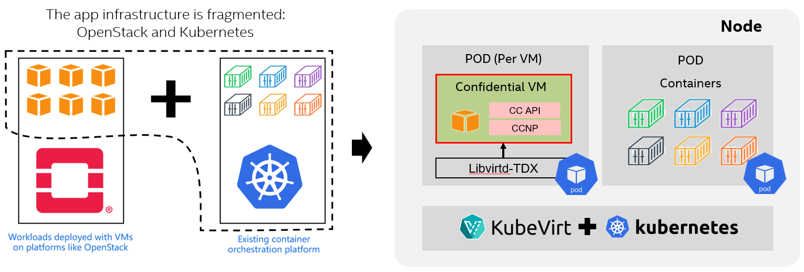

# KubeVirt CVM

[KubeVirt](https://kubevirt.io/) is a CNCF project that extends Kubernetes to manage virtualized workloads.
It allows you to run full virtual machines on Kubernetes alongside regular containers. This integration of
VMs and containers enables you to leverage the benefits of both worlds seamlessly. 
Confidential virtual machines (CVMs) are one of the use cases of confidential computing technology. It leverages
hardware technologies provided by different vendors, such as Intel TDX and AMD SEV-SNP, as well as corresponding software stacks.

## Introduction

The project aims to extend KubeVirt capability of managing CVM as a deployment flavor of confidential computing cloud native use cases.
CVM managed by KubeVirt will also be able to run on Kubernetes as well as provide confidential VM capabilities
to protect confidentiality and integrity for workloads.

The project provides content as below.

- [Deployment guide](./tdx/deployment/README.md) for running Intel TDX guest (TD) with KubeVirt.
- Additional [patches](./tdx/patches/) to run Intel TDX guest. See more details in the patches.
- [CC Trusted API](https://github.com/cc-api/cc-trusted-api) usage example to collect evidence.
